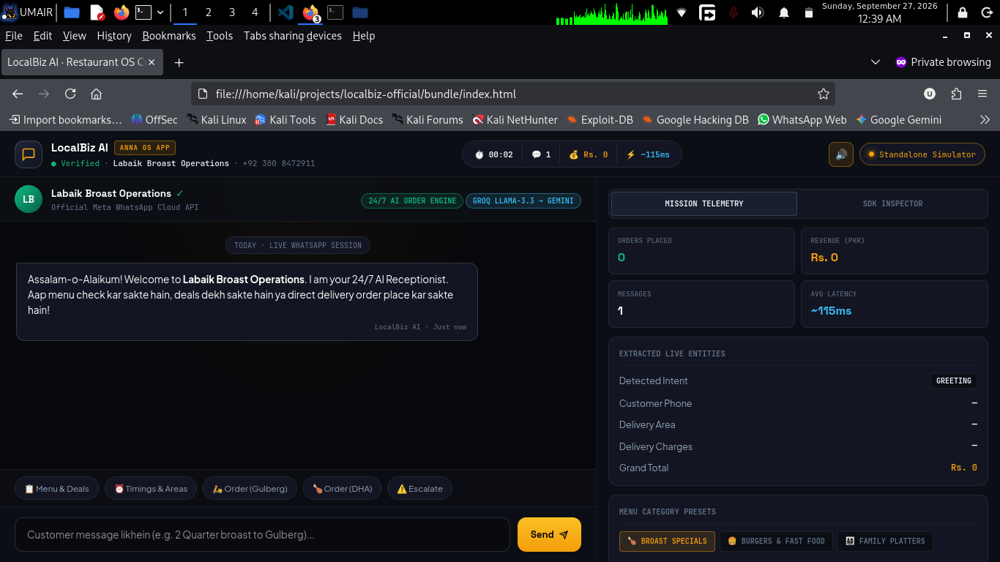

<div align="center">
  <h1>🍽️ LocalBiz AI — Autonomous Restaurant Receptionist</h1>
  <p><b>24/7 AI-Powered WhatsApp Food Ordering, Live Dispatch Engine & Thermal POS Printing for Anna AI OS</b></p>

  <p>
    <a href="https://anna.partners"></a>
    <a href="#-official-anna-os-tool-specification"></a>
    <a href="https://opensource.org/licenses/MIT"></a>
    <a href="https://developers.facebook.com/docs/whatsapp"></a>
  </p>

  <p>
    <a href="https://anna.partners"></a>
    <a href="#-quick-start-5-minutes"></a>
    <a href="#privacy"></a>
  </p>

  <br/>
  
</div>

---

> **Enterprise-grade restaurant automation at $0 SaaS subscription fees.**  
> LocalBiz AI replaces expensive third-party dispatch aggregators and manual order desks by pairing the **Official Meta WhatsApp Cloud API** with **Dual-Engine LLM Failover (Groq Llama 3.3 ⚡ → Gemini 2.0 Flash 🛡️)** and an interactive **Live Orders Cockpit** running natively on **Anna AI OS**.

---

## 📋 Table of Contents

1. [Why LocalBiz AI](#-why-localbiz-ai)
2. [Features](#-features)
3. [Architecture Overview](#️-architecture-overview)
4. [Official Anna OS Tool Specification](#-official-anna-os-tool-specification)
5. [Tech Stack](#-tech-stack)
6. [Prerequisites](#-prerequisites)
7. [Quick Start (5 minutes)](#-quick-start-5-minutes)
8. [Detailed Setup Guide](#-detailed-setup-guide)
   - [Meta WhatsApp Cloud API Setup](#1-meta-whatsapp-cloud-api-setup)
   - [Groq API Key Setup](#2-groq-api-key-setup)
   - [Gemini API Key Setup](#3-gemini-api-key-setup)
   - [Environment Configuration](#4-environment-configuration)
   - [Running Locally with Docker](#5-running-locally-with-docker)
   - [Running Without Docker](#6-running-without-docker-for-development)
9. [Webhook Configuration (ngrok)](#-webhook-configuration-ngrok)
10. [Testing the Bot](#-testing-the-bot)
11. [Deployment to Production](#-deployment-to-production)
12. [Troubleshooting & Common Errors](#-troubleshooting--common-errors)
13. [API Endpoints](#-api-endpoints)
14. [Environment Variables Reference](#-environment-variables-reference)
15. [Project Structure](#-project-structure)
16. [Contributing](#-contributing)
17. [License](#-license--open-source-usage)
18. [FAQs](#-frequently-asked-questions-faqs)
19. [Privacy & Data Handling Policy](#privacy)

---

## 🌟 Why LocalBiz AI

| Feature | ManyChat / Intercom / Tidio | **LocalBiz AI (This Project)** |
|---|---|---|
| **Monthly Cost** | $15 – $300+ / mo | **$0** (Meta free tier + Groq/Gemini free tiers) |
| **WhatsApp Integration** | Third-party proxy | **Official Meta Cloud API** – 1,000 free conversations/month |
| **Ban Risk** | Moderate to High | **Zero** (100% policy-compliant official API) |
| **AI Intelligence** | Static GPT-3.5 prompt | **Dual Failover** – Llama 3.3 (70B) → Gemini 2.0 Flash |
| **Latency** | 3 – 6 seconds | **1 – 2 seconds** (Ultra-fast Groq LPU inference) |
| **Data Sovereignty** | Vendor-locked | **Self-hostable & Local-first** via Docker & Anna OS |
| **License** | Closed Proprietary | **MIT License** (Free commercial use) |

---

## ✨ Features

- ✅ **Official Meta WhatsApp Cloud API** – Cloud-native, zero QR code tethering, zero account ban risk.
- ✅ **Dual-Engine LLM Failover** – Groq Llama 3.3 handles primary sub-second queries; Gemini 2.0 Flash activates seamlessly on rate limits.
- ✅ **Interactive Anna OS Cockpit** – Real-time visual order queue with instant status toggle and audio notifications.
- ✅ **Thermal Receipt Generation** – Automatic 80mm ESC/POS Kitchen Order Ticket (KOT) formatting.
- ✅ **Docker Orchestration** – One-command production deployment with multi-platform compatibility.
- ✅ **Production-Grade Audit Trails** – Comprehensive structured logging for inbound payloads, NLP extraction, and webhook responses.

---

## 🏗️ Architecture Overview

```text
[Customer] ---> (WhatsApp) ---> [Meta Cloud API] ---> (HTTP POST Webhook) ---> [FastAPI Server]
                                                                                     |
                                                                                     v
                                                                            [AI Failover Router]
                                                                                     |
                                                                            (Primary) Groq Llama 3.3
                                                                                     | (on failure)
                                                                            (Fallback) Gemini 2.0 Flash
                                                                                     |
                                                                                     v
                                                                          [Order Extraction Engine]
                                                                                     |
                                                                                     +---> [Anna Cockpit / POS Dispatch]
                                                                                     |
[Customer] <--- (WhatsApp) <--- [Meta Cloud API] <--- (HTTP POST Reply) <------------+

```

## ⚙️ Official Anna OS Tool Specification

LocalBiz AI is verified and packaged as a sandboxed native tool on **Anna AI OS**:

| **Specification**          | **Target Details**                                                  |
| -------------------------- | ------------------------------------------------------------------- |
| **App Slug**               | `localbiz-official` (App ID: 342)                                   |
| **Registered Tool ID**     | `tool-umairs759-localbiz-official-bcxnqkk6`                         |
| **Runtime Engine**         | Sandboxed Python 3.11+ Executa Runtime (v0.1.0 / Version ID: 942)   |
| **Registered Tool Method** | `order_dispatch(customer_message: string)`                          |
| **POS Receipt Standard**   | 80mm ESC/POS Automated Kitchen Order Ticket (KOT) Payload           |
| **CSP Compliance**         | Hardened local stylesheets; zero unapproved external font CDN calls |

## 🛠️ Tech Stack

| **Component**          | **Technology**                 | **Purpose**                                                     |
| ---------------------- | ------------------------------ | --------------------------------------------------------------- |
| **Backend Framework**  | FastAPI (Python 3.11+)         | Asynchronous execution, schema validation, high throughput      |
| **WhatsApp Layer**     | Meta Cloud API v18.0+          | Official business messaging, webhook delivery                   |
| **Primary LLM**        | Groq Llama 3.3 (70B Versatile) | Sub-second intent extraction and natural conversational answers |
| **Fallback LLM**       | Google Gemini 2.0 Flash        | High-availability failover protection                           |
| **OS Cockpit & Tools** | Anna AI OS App Platform        | Visual management dashboard and sandboxed tool integration      |
| **Deployment**         | Docker & Docker Compose        | Containerized isolated reproducible runtime                     |

## 📋 Prerequisites

Before running the application, make sure you have:

- A verified [Meta for Developers](https://developers.facebook.com/?utm_source=gemini) account with a WhatsApp Business App.

- A **Groq API Key** (obtain free from [console.groq.com](https://console.groq.com/?utm_source=gemini)).

- A **Google Gemini API Key** (obtain free from [aistudio.google.com](https://aistudio.google.com/?utm_source=gemini)).

- **Docker Engine** & **Docker Compose** installed (or Python 3.11+ locally).

- **ngrok** installed (for tunneling webhook events during local development).


## ⚡ Quick Start (5 minutes)

Bash

```
# 1. Clone the repository
git clone [https://github.com/umairs759/LocalBiz-AI-WhatsApp-Agent.git](https://github.com/umairs759/LocalBiz-AI-WhatsApp-Agent.git)
cd LocalBiz-AI-WhatsApp-Agent

# 2. Configure environment credentials
cp backend/.env.example backend/.env
nano backend/.env   # Populate API keys

# 3. Spin up the container stack
docker-compose up -d

# 4. Open an HTTPS tunnel for webhooks (in a separate terminal)
ngrok http 8000

```

## 📖 Detailed Setup Guide

### 1. Meta WhatsApp Cloud API Setup

1. Open the **Meta App Dashboard** → Select **WhatsApp** → **API Setup**.

2. Note down your **Phone Number ID** and **WhatsApp Business Account ID**.

3. Generate a permanent System User Access Token with the `whatsapp_business_messaging` permission.

4. Add your personal WhatsApp number to the test recipient list.

5. Place the access token in your `backend/.env` file as `WHATSAPP_TOKEN`.


### 2. Groq API Key Setup

1. Log in to [console.groq.com](https://console.groq.com/?utm_source=gemini).

2. Navigate to **API Keys** → Click **Create API Key**.

3. Save the key in `backend/.env` as `GROQ_API_KEY`.


### 3. Gemini API Key Setup

1. Visit [Google AI Studio](https://aistudio.google.com/?utm_source=gemini).

2. Click **Get API key** and generate a standard API key.

3. Save the key in `backend/.env` as `GEMINI_API_KEY`.


### 4. Environment Configuration

Ensure `backend/.env` contains exact keys without quotes:

Code snippet

```
WHATSAPP_TOKEN=EAAxxxxxxxxxxxxxxxxxxxxxxxxxxxx
VERIFY_TOKEN=LocalBizSecureVerifyToken2026
PHONE_NUMBER_ID=123456789012345
GROQ_API_KEY=gsk_xxxxxxxxxxxxxxxxxxxxxxxxxxxx
GEMINI_API_KEY=AIzaSyxxxxxxxxxxxxxxxxxxxxxxxxx

```

### 5. Running Locally with Docker

Bash

```
docker-compose up -d --build
docker-compose logs -f

```

### 6. Running Without Docker (For Development)

Bash

```
cd backend
python3 -m venv venv
source venv/bin/activate
pip install -r requirements.txt
uvicorn main:app --reload --host 0.0.0.0 --port 8000

```

## 🔗 Webhook Configuration (ngrok)

1. Start your local tunnel:

   Bash

   ```
   ngrok http 8000

   ```

2. Copy the generated HTTPS endpoint (`https://<id>.ngrok-free.app`).

3. In Meta Dashboard → **WhatsApp** → **Configuration** → **Edit Webhook**:

   - **Callback URL:** `https://<id>.ngrok-free.app/webhook`

   - **Verify Token:** Value of `VERIFY_TOKEN` from your `.env`


4. Click **Verify and Save**, then under **Webhook fields**, click **Manage** and subscribe to **`messages`**.


## 🧪 Testing the Bot

Send customer order messages to your WhatsApp Business number:

- *"Hi, what deals do you have available today?"*

- *"I'd like to order 2 Zinger Burgers and a 1.5L Coke to Gulberg III, Lahore."*

- *"Can I pay via Cash on Delivery?"*


Check your terminal logs to verify the execution flow:

Plaintext

```
INFO: Groq primary model intent parsing success: 2 items identified
INFO: Thermal KOT Ticket generated -> Order #1042
INFO: Meta WhatsApp dispatch callback status: 200 OK

```

## 🚀 Deployment to Production

### Option 1: Render.com (Docker Web Service)

1. Fork or push this repository to GitHub.

2. Create a new **Web Service** on Render connected to your repository.

3. Choose **Docker** as runtime environment.

4. Input all `.env` credentials in the **Environment Variables** panel.

5. Provide Render's public HTTPS URL to Meta's webhook configuration.


### Option 2: Railway.app

1. Create a new Railway project from your GitHub repository.

2. Set up environment variables in the dashboard.

3. Use the generated deployment URL as the webhook address.


### Option 3: Production Linux VPS / Cloud Host

Bash

```
sudo apt update && sudo apt install docker.io docker-compose -y
git clone [https://github.com/umairs759/LocalBiz-AI-WhatsApp-Agent.git](https://github.com/umairs759/LocalBiz-AI-WhatsApp-Agent.git)
cd LocalBiz-AI-WhatsApp-Agent
cp backend/.env.example backend/.env
docker-compose up -d --build

```

*Configure an Nginx reverse proxy with a Let's Encrypt SSL certificate to satisfy Meta's HTTPS requirement.*

## 🐛 Troubleshooting & Common Errors

| **Error Symptom**              | **Root Cause**              | **Resolution**                                                               |
| ------------------------------ | --------------------------- | ---------------------------------------------------------------------------- |
| `403 Forbidden` on Webhook     | Mismatched verify token     | Ensure Meta Developer Console token matches `VERIFY_TOKEN` in `.env`.        |
| `invalid access token`         | Expired temporary token     | Generate a permanent System User token inside Meta Business Manager.         |
| `Rate limit exceeded (Groq)`   | High request volume         | The system automatically falls back to Gemini 2.0 Flash within 200ms.        |
| `Executa tool mismatch`        | Invalid Tool ID in manifest | Ensure Anna tool matches `tool-umairs759-localbiz-official-bcxnqkk6`.        |
| Unresponsive WhatsApp delivery | Webhook not subscribed      | Check Meta dashboard to ensure the `messages` subscription toggle is active. |

## 📡 API Endpoints

| **Method** | **Endpoint** | **Description**                                          |
| ---------- | ------------ | -------------------------------------------------------- |
| `GET`      | `/webhook`   | Meta verification challenge handshake                    |
| `POST`     | `/webhook`   | Inbound WhatsApp payload ingest & dispatch router        |
| `GET`      | `/health`    | Application status, model readiness, and heartbeat check |

## 🔧 Environment Variables Reference

| **Variable**      | **Required** | **Description**                                           |
| ----------------- | ------------ | --------------------------------------------------------- |
| `WHATSAPP_TOKEN`  | Yes          | Permanent Meta System User Graph API access token         |
| `VERIFY_TOKEN`    | Yes          | Custom secret string used to verify webhook integrity     |
| `PHONE_NUMBER_ID` | Yes          | Numeric Phone Number ID assigned by Meta Business Manager |
| `GROQ_API_KEY`    | Yes          | Secret API Key for ultra-fast Llama 3.3 inferencing       |
| `GEMINI_API_KEY`  | Yes          | Secret API Key for high-reliability fallback inferencing  |

## 📁 Project Structure

Plaintext

```
LocalBiz-AI-WhatsApp-Agent/
├── .anna/                       # Anna OS internal build cache (gitignored)
├── bundle/                      # Production UI Cockpit assets for Anna OS
│   └── index.html               # Live Restaurant Cockpit, order stream & POS printer
├── executas/                    # Anna OS Backend Plugins
│   └── localbiz-official/
│       ├── executa.json         # Executa Tool definition & schema
│       └── localbiz_official_plugin.py # Sandboxed dispatch & order parser
├── backend/                     # Standalone FastAPI microservice
│   ├── main.py                  # Meta Webhook handler & dispatch router
│   ├── requirements.txt         # Production dependencies
│   ├── .env.example             # Environment configuration template
│   └── utils/
│       ├── __init__.py          # Package initialization
│       └── ai_failover.py       # Groq Llama 3.3 -> Gemini 2.0 Flash logic
├── manifest.json                # Anna AI OS official App Manifest (v0.1.0)
├── cover.png                    # High-res Cockpit dashboard screenshot
├── docker-compose.yml           # Multi-container orchestration
├── Dockerfile                   # Hardened production container
├── .gitignore                   # Credential & secret protection
├── LICENSE                      # MIT Open Source License
├── CONTRIBUTING.md              # Contribution guidelines
└── README.md                    # Project documentation & Privacy Policy

```

## 🤝 Contributing

Contributions are welcomed. Please read `CONTRIBUTING.md`, adhere to PEP 8 standards, maintain clean modular architecture, test changes locally via Docker, and open focused pull requests.

## 📄 License & Open-Source Usage

This software is distributed under the **MIT License**. You are free to self-host, customize, bundle, or commercialize this solution for local restaurants and small businesses without license fees.

## ❓ Frequently Asked Questions (FAQs)

**Q: Can this bot cause my WhatsApp number to get banned?**

**A:** No. This project exclusively integrates with the **Official Meta Cloud API**. It does not use unofficial web-scraping libraries or browser automation tools, guaranteeing zero account ban risk.

**Q: Does Meta charge for messages?**

**A:** Meta offers **1,000 free service-initiated conversations every month**. Standard customer-initiated restaurant food inquiries fall directly under this free tier.

**Q: How does the Anna OS integration work?**

**A:** The restaurant cockpit renders locally inside Anna OS via `bundle/index.html`. It establishes communication with the sandboxed `order_dispatch` Executa plugin to parse incoming tickets and issue live print commands to POS printers.

## 🔒 Privacy & Data Handling Policy

LocalBiz AI is engineered with strict data isolation and enterprise-grade privacy principles:

- **Zero Retention of Ephemeral Chats:** Customer messages parsed during food ordering sessions are processed in-memory for intent extraction and discarded post-dispatch.

- **Direct Merchant-Customer Channel:** WhatsApp communication runs via official Meta Cloud API directly through the business's registered WhatsApp Business Account (WABA).

- **Stateless Tool Execution:** The Anna OS Executa runtime (`tool-umairs759-localbiz-official-bcxnqkk6`) executes sandboxed order dispatch routines without long-term personal identifier tracking.

- **Compliance:** Built to comply with local commercial privacy standards and standard Anna AI OS app store sandbox constraints.
